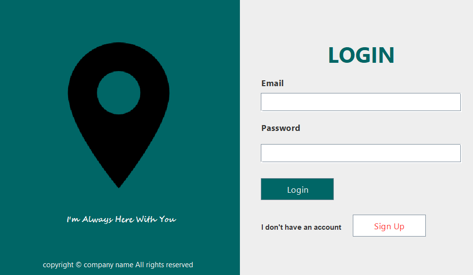
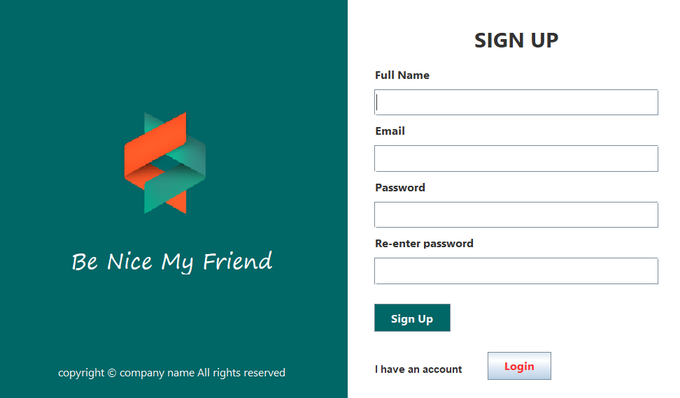

# Welcome to LoginAndSignUp Repository
### You will find in this repo the following stuff:
* Swing 
* JDBC library to connective with mySQL database
* ...

### Login:

### Sign Up: If you dont have an account, so you can sign up an account.
### You can sign up more account. If email has been signed before. You can't use again.
### JDBC to connect to mySQL database. 
### Class ConnectionProvider is an Object that provide a service for us to connect to database that we can execute query 
### Class table is an object for us to create a table or update table
### Class Login and sign up is built by javaSwing that we can interact with inerface.

#### © 2024 ji-Ly
